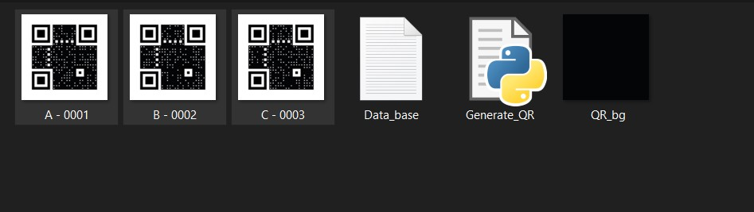

# QR-code-based-Excel-Attendace
* Freelancing Project

# How to generate QR code?

- In the `QR Codes` folder

1. Update the data base in file `Data_base.txt`. Make sure each students name resides in a new line without any space.  
  

2. Run the `Generate_QR.py` file by double clicking on it.  
  

3. Required QR code for the data base will be created.  
  
